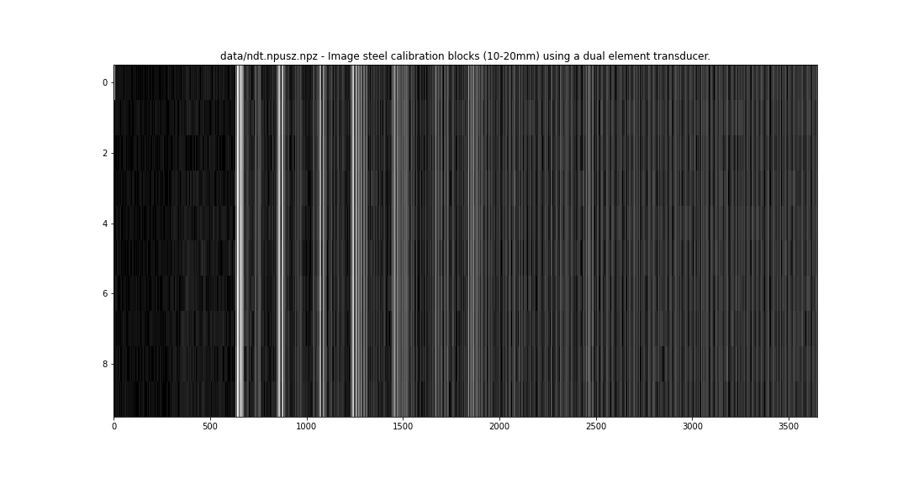

# Notebooks 

### Introduction to RF signal processing

* Notebook: [00.RF_Processing.ipynb](00.RF_Processing.ipynb)
* What? Getting raw data and pushing a scan conversion.
* Tags: scanconversion, filtering

### NDT experiments

* Notebook: [01.NDT_Processing.ipynb](01.NDT_Processing.ipynb)
* What? NDT experiments
* Tags: ndt

### Introduction to scan conversion

* Notebook: [03.ScanConversion.ipynb](03.ScanConversion.ipynb)
* What? Introduction to scan conversion.
* Tags: scanconversion

### Compression of RF signals

* Notebook: [04.Compressions_of_signals.ipynb](04.Compressions_of_signals.ipynb)
* What? Exploring data compression, to assess feasibility of processing methods.
* Tags: alaw, compression

# List of datasets 
Here are stored ultrasound rf signals, mostly in npz to facilitate loading information. Accompanying images may contain metadata about the data acquisition.
## hp2121

#### Image from a wirephantom bis using an hp2121 probe with un0rick.

[Link to data](data/hp2121.npusz.npz)

## kretzaw145ba

#### Image from a wirephan bis using an kretzaw145ba probe with un0rick.

[Link to data](data/kretzaw145ba.npusz.npz)

## ndt

#### Image steel calibration blocks (10-20mm) using a dual element transducer.

[Link to data](data/ndt.npusz.npz)

## probeX

#### Image from a wirephantom using a ATL3 probe with older modules.

[Link to data](data/probeX.npusz.npz)

## atl3_31c

#### Image from a wirephantom using an ATL3 probe with un0rick.

[Link to data](data/atl3_31c.npusz.npz)

## brd35

#### Image from a wirephantom using a bard 3.5 probe with un0rick.

[Link to data](data/brd35.npusz.npz)

