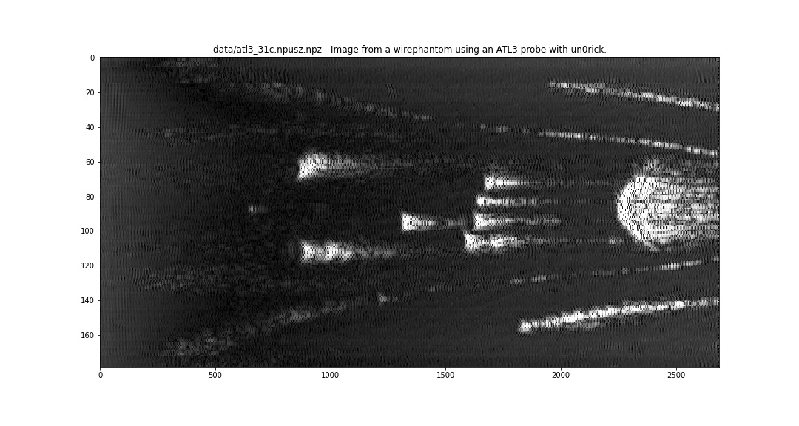
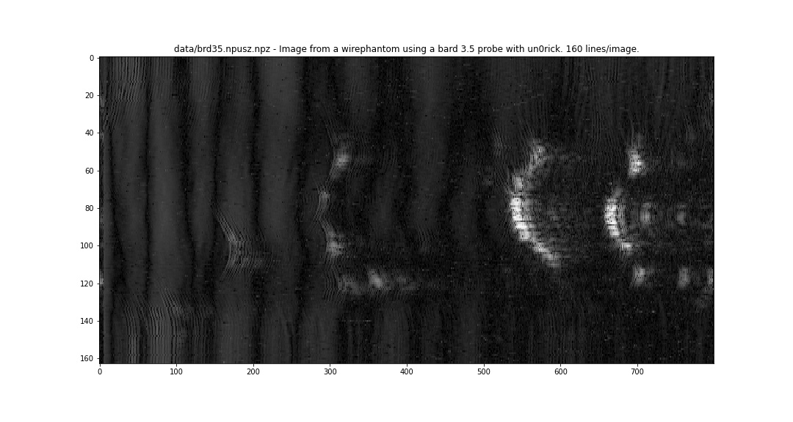

# List of datasets 
## ndt

#### Image steel calibration blocks (10-20mm) using a dual element transducer.

[Link to data](data/ndt.npusz.npz)

## probeX

#### Image from a wirephantom using a ATL3 probe with older modules.

[Link to data](data/probeX.npusz.npz)

## atl3_31c

#### Image from a wirephantom using an ATL3 probe with un0rick.

[Link to data](data/atl3_31c.npusz.npz)

## brd35

#### Image from a wirephantom using a bard 3.5 probe with un0rick.

[Link to data](data/brd35.npusz.npz)

